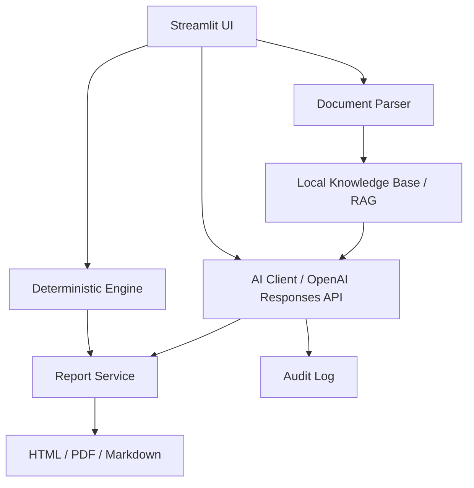

# ChemSafe Pro AI v3.0

Plataforma Streamlit para **segurança de processo assistida por IA**, com arquitetura híbrida:

- **motor determinístico** para HAZOP base, LOPA, SIL, dispersão gaussiana e pool fire;
- **camada de IA** para copiloto técnico, pré-HAZOP, extração documental, RAG local e geração de relatórios profissionais.

## O que esta versão já entrega

- Consulta química / SDS screening
- HAZOP base + **pré-HAZOP por IA a partir de texto livre**
- Bow-Tie simplificado
- LOPA → SIL com IPLs configuráveis
- Dispersão gaussiana screening
- Pool fire screening
- **Document Intelligence** com upload de PDF/DOCX/XLSX/CSV/TXT/JSON
- **RAG local** com embeddings OpenAI quando disponíveis e fallback lexical offline
- **Copiloto técnico** com contexto documental e memória da sessão
- **Centro de relatórios** com HTML, Markdown e PDF com design executivo
- **Trilha de auditoria** de chamadas LLM em `.chemsafe_audit/audit_log.jsonl`

## Arquitetura



## Stack

- Streamlit
- OpenAI Python SDK
- PyMuPDF
- python-docx
- pandas
- reportlab
- jinja2

## Instalação

```bash
python -m venv .venv
source .venv/bin/activate  # Windows: .venv\\Scripts\\activate
pip install -r requirements.txt
cp .env.example .env
# edite OPENAI_API_KEY se quiser habilitar IA
streamlit run app.py
```

## Limitações importantes

- Os cálculos de consequência são **screening models**.
- A IA foi posicionada como **copiloto técnico**, não como autoridade regulatória.
- PFDs típicos em LOPA precisam de revisão de independência e adequação ao caso real.
- Para estudos regulatórios, use ferramentas e fluxos de trabalho validados pela sua organização.
